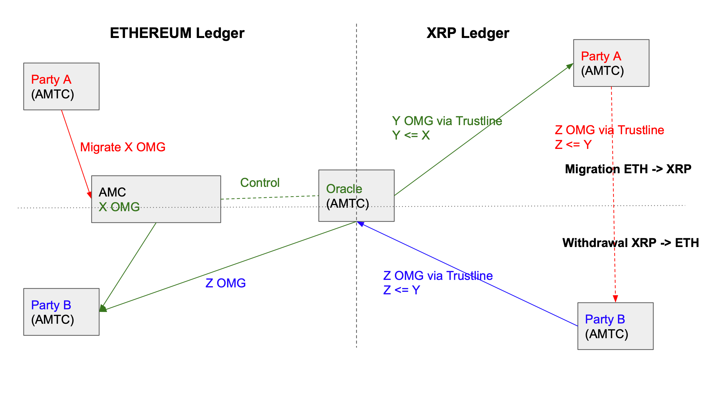
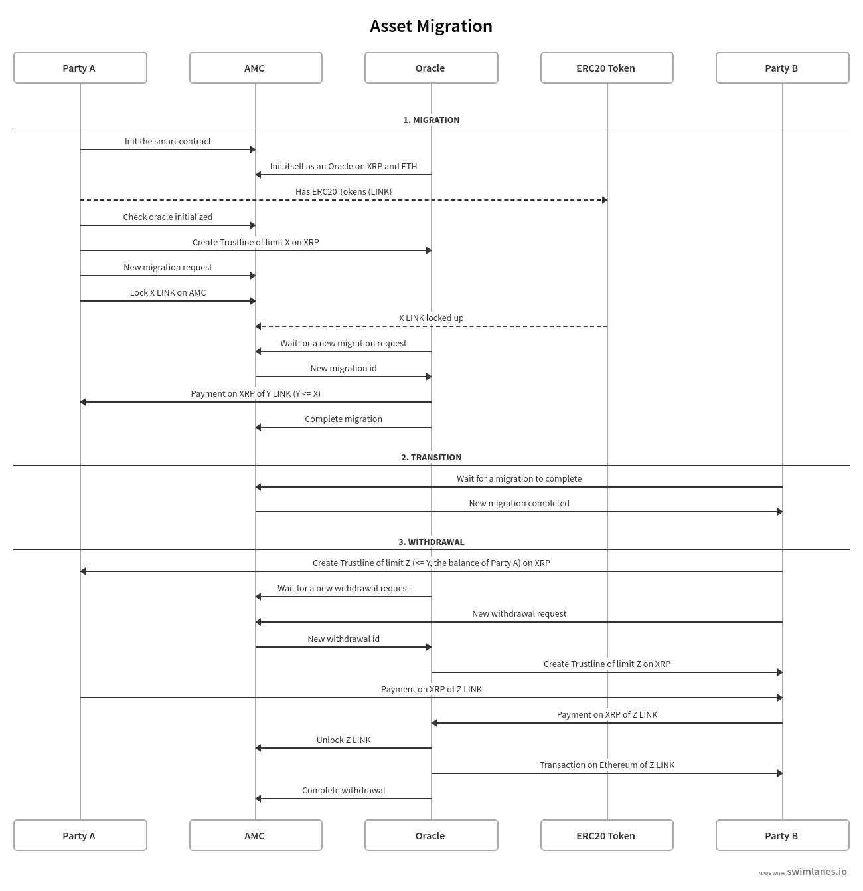
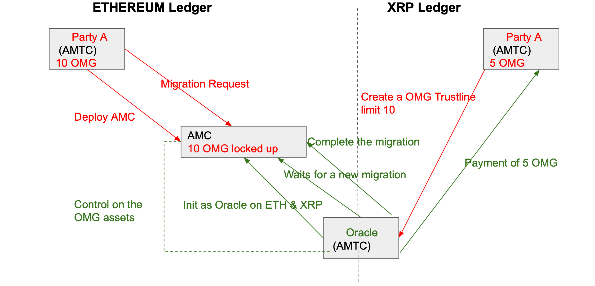
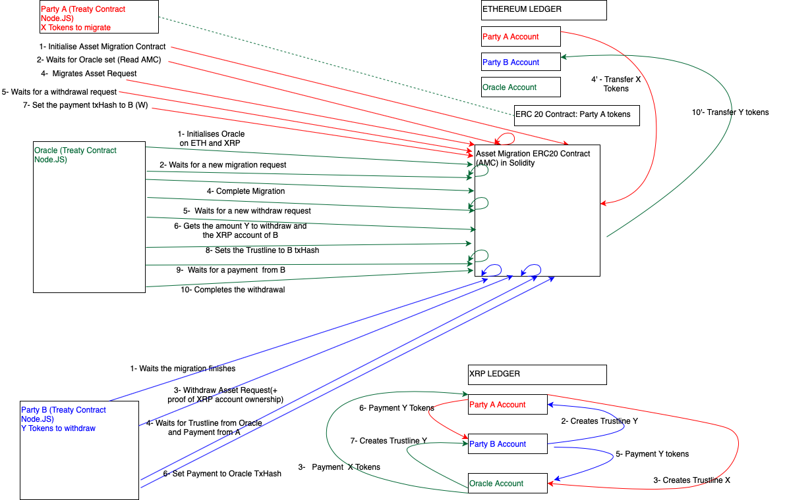
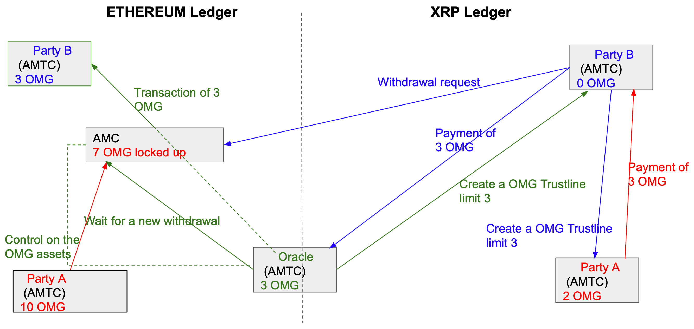

(LATEST VERSION/ MUST RUN WITH THE JAVASCRIPT SDK VERSION WITH TRUSTLINES https://github.com/quantnetwork/overledger-sdk-javascript/tree/ethereum-smart-contract-after-demo-and-trustline-2)

# ASSET MIGRATION AND WITHDRAWAL  (ETHEREUM AND XRP)

# Problem to solve and general overview

This is the Minimal Viable Prototype to demonstrate asset migration functionality. Specifically we are looking at one of the more complicated use-cases where a digital asset that cannot be recreated on a ledger is temporarily migrated from one ledger to another and back again. To help allow for this migration to occur we introduce a 3rd party Oracle who is in charge of locking the asset on one ledger and generating it’s digital twin on another ledger (or vis versa). This Oracle is a trusted entity to keep the asset locked on one chain when it is being traded on the other chain. 

We do not need an Oracle for:
- permanent asset migration (as we can permanently destroy the asset on the first ledger)
- temporary asset migration for an asset that can be re-created on the first ledger (as we can destroy the asset on the migrating ledger and re-create it when needed)

Future work: If we do not want one Oracle to be in control of this migration process, we can use multiple Oracles (known as decentralised Oracles), the most popular implementation being from Chainlink. Further more, we can introduce inclusion proofs to a single or decentralised oracle design to make it more difficult for an Oracle to fabricate information. Inclusion proofs require Oracles to post block header information of one ledger into another ledger and then provide a Merkle proof that a transaction was linked to in the block header.

Returning to our demo. We have the following setup:
  
* Three actors are involved in the asset migration demo (An Oracle, Party A and Party B)

* ERC20 tokens on Ethereum will be migrated to the XRP ledger and will be migrated back to Ethereum on demand

* We use an Oracle as we are migrating ERC20 tokens that have a finite-fixed supply, i.e. all possible ERC-20 tokens of this type have already been created.

* The Oracle is the issuer of ERC20 tokens on the XRP Ledger. This currency is called an issued currency on the XRP ledger.

* The Oracle is the owner of the asset migration smart contract on the Ethereum ledger. Sending ERC20 tokens to the address of the asset migration smart contract locks the tokens in escrow, where only the Oracle can move them out of this asset migration smart contract.
 
* The rules of our Asset Migration Treaty Contract says that the Oracle must have ERC20 tokens in its possession (here from Party A, but can be from multiple customers on the Ethereum DLT) to be able to issue ERC20 tokens on the XRP ledger. Note that as all actors hold their private keys we cannot enforce the actions of any individual and so we cannot enforce that the Oracle abides by the logic of the Treaty Contract. But we can embed functions into the Treaty Contract that can notify Party A or Party B if the Oracle does not conform to the logic embedded within the Treaty Contract.

* In our demo flow, the ERC20 tokens are sent by Party A to the Oracle, by sending the tokens to the asset migration contract. At the same time, Party A creates a trustline between Party A and the Oracle on the XRP ledger for this ERC20 token.
 
* As Party A provides ERC20 tokens to the Oracle, it can claim them back on the XRP ledger through a payment of issued ERC20 tokens, from the Oracle to Party A, over a trustline between the two parties. The Oracle issues this token with an XRP ledger payment transaction. 
 
* Now the demo proceeds by Party A sending ERC20 tokens (issued on the XRP ledger) to Party B, trading over a Trustline between the two parties.
 
* Party B has now received ERC20 tokens on the XRP ledger and wants to migrate them back to the Ethereum ledger.
 
* Over a trustline created by the Oracle between itself and the Party B, Party B sends an amount of issued ERC20 tokens to the Oracle on the XRP Ledger.
 
* Then the Oracle unlocks the same ERC20 tokens amount on the Ethereum ledger from the smart contract and sends them to Ethereum's Party B address.

# Components

* `DLT`s: `Ethereum` and `XRP` Ledger.

* `Asset Migration Smart Contract (AMC)`: Smart Contract in the Ethereum Ledger. It locks the assets to be migrated and only the Oracle can unlock them. It is written in Solidity.

* `Asset Migration Treaty Contract (AMTC)`: A Treaty Contract details the rules of interaction between the multiple DLTs, i.e. it contains the multi-distributed ledger logic. It can be written in any language, instantiated and shared between multiple participants and be run in many locations at the same time. It can call directly the DLT node (Ethereum or XRP) or the `AMC`. It is written in Javascript/Node.js.

* `ERC20 Token`: assets to be locked up in the migration and unlocked while getting them back on the Ethereum Ledger (OMG, LINK, BNB,...).

* `Trustline`: object allowing to perform payment transactions between accounts in a non-XRP currency in the XRP Ledger.

# Parties

* `Party A`: it runs an `ATMC`. It migrates ERC20 Tokens from Ethereum to XRP. ERC20 Tokens are then locked up in the `AMC` and the Oracle pays it back the equivalent amount in the same currency on the XRP Ledger.

* `Party B`: it runs an `ATMC`. It withdraws  ERC20 Tokens from XRP to Ethereum. It pays ERC20 Tokens on XRP to the Oracle and gets them back on the Ethereum Ledger from the Oracle. The Oracle uses the ERC20 Tokens locked up on the `AMC`.

* `Oracle`: it runs an `ATMC`. A trusted third party that locks the asset to be migrated to a ledger to another and back again. 

# Technical descriptions

## PARTY A: Migration of ERC20 Tokens from Ethereum Ledger to XRP Ledger

### Migration

1. Initialization of the Asset Migration Smart Contract (AMC)

* `Party A` runs a local instance of the `Asset Migration Treaty Contract (AMTC)`.

* It deploys the `Asset Migration Smart Contract (AMC)` on Ethereum and initialises it using the constructor or finds an already deployed `AMC` (using the `initialiseAssetsMigrationContract` function of the `AMTC`).

* When the `AMC` is created, the `Oracle` can be run.

2. Waiting for the Oracle to be initialized on the `AMC`

* It waits in a loop until the `Oracle` is set in the `AMC` for the XRP and Ethereum Ledgers (using the `getOracleOnOtherLedger` function of the `AMTC` which is reading the `getOracleAccountOnOtherLedger` function of the `AMC`).

3. Creation of a Trustline object to the `Oracle`

* When the `Oracle` is set on the `AMC` and then the Oracle's XRP address can be read from the `AMC`, `Party A` creates a Trustline object to the `Oracle` on the XRP Ledger (using the `createTrustlineTransaction` function of the `AMTC`). The limit of the trustline must support the payment's amount X the `Oracle` will have to sent to `Party A` on the XRP Ledger when the tokens from `Party A` will be transferred to the `AMC `and locked up there.

4. ERC20 Token asset migration request

* It performs a migration request to the `AMC` (`migrateERC20AssetsToLock` on the `AMTC` which is calling the `migrateAssetsRequest` function of the `AMC`).
At this step, an amount X of an ERC20 token is transferred from `Party A`'s Ethereum address to the `AMC`  address ( using the core ERC20 solidity function interface `transferFrom`). These tokens are then locked by the `AMC` and can be unlocked only by the `Oracle`. In our scenario, they will be spent when a withdrawal request will be made by `Party B`.

### Withdrawal

5. Reading a new withdrawal request

* It waits for a new withdrawal request, here from `Party B`. It is calling the `readData` (in the `AMTC`) to read the data from the `AMC`. When the `totalWithdrawalRequests` variable is incremented in the `AMC`, this means a new withdrawal request has been sent to the `AMC` from a party running an instance of the `AMTC` in our demo, or more generally, calling the withdrawal request function of the `AMC` to initialise a new withdrawal request on the `AMC`. 

6. Payment to the withdrawal requester `Party B`

* It performs then a payment to `Party B` (`makeIssuedCurrencyPayment`) on the XRP Ledger using the Trustline that `Party B` has created to `Party A`. The amount Y of the payment is read from the `AMC` as it is the amount set by `Party B` when it has performed the withdrawal request to the `AMC`. IN DEPLOYMENT WE WOULD HAVE TO THINK OF A DIFFERENT WAY FOR PARTY B AND PARTY A TO TRANSFER ERC-20 ON XRP_LEDGER AS PARTY B MAY NOT WANT TO WITHDRAW ERC-20 INTO ETHEREUM AND MAY WANT TO CONTINUE TRADING IT ON THE XRP_LEDGER

7. Update data control on the `AMC`

* `Party A` set the transaction hash of the last payment to `Party B` on the `AMC`. This transaction hash will be read, along with the transaction hash of the Trustline from the `Oracle` to `Party B`, by `Party B` to let it perform the payment to the `Oracle` on the XRP Ledger.

 

-------------------------------------

## Oracle

### Migration

1. `Oracle` initialization on the `AMC`

* The Oracle runs a local instance of the `Asset Migration Treaty Contract AMTC`, when `Party A` has the `AMC `address.

* It gets the latest `AMC`. The called function is `getLatestContract` on the `AMTC`, given the sha256 hash of the smart contract byte code through `contractIdentifier` variable set on the `AMC` when deploying it.

* It reads the total number of migrations and withdrawals request (`getRequestId` function of the `AMTC` to get the values of `totalMigrationRequests` and `totalWithdrawalRequests` `AMC` variables).

* It initializes itself as an Oracle on XRP and Ethereum Ledgers (`initialiseOracleOnOtherLedger` on  the `AMTC` calling `addCreationAccountOnOtherLedger` function of the `AMC`), if it has not already (`getOracleOnOtherLedger` on the `AMTC` calling `oracleAccountOnOtherLedger` map on the `AMC`).

2. Reading a new migration request

* It waits for a new migration request, here from `Party A`. It is calling the `readData` `AMTC` function to read data from the `AMC`. When the `totalMigrationRequests` on the `AMC` is incremented, this means a new migration request has been sent to the `AMC` from a party running an instance of the `AMTC`.

* It gets the XRP address of the user requesting for the asset migration and the amount which is due to be sent to it on the XRP ledger (`readMigrationWithdraw` on  the `AMTC`) after this same user has already sent an amount of ERC20 tokens to the `AMC` on the Ethereum Ledger. This user is `Party A` in our scenario.

3. Payment to the migration requester 

* It performs then a payment to `Party A` (`makeIssuedCurrencyPayment` on the `AMTC`) on the XRP Ledger using the Trustline that `Party A` has created to the `Oracle`. The `Oracle` is playing the role of a non-XRP currency issuer, having the source of issuance from the `AMC` where parties requesting for migration put there ERC20 tokens in to be paid on the XRP Ledger in exchange.  The payment's amount will be done in the ERC20 token symbol. In our scenario, the amount of this payment can be less or equal than the amount of the ERC20 tokens sent by `Party A` to the `AMC`.

4. Finishing the migration request on the `AMC`

* It completes the migration request (using the `completeMigration` function of the `AMTC` calling the `completedMigrationRequest` on the `AMC`) by sending data to terminate the migration by updating data on the `AMC` for the already processed migration identifier. It increments the total number of the completed migrations and set the current one to a completed state.

### Withdrawal

5. Reading a new withdrawal request

* It waits for a new withdrawal request, here from `Party B`. It is calling the `readData` to read the data from the `AMC`. When the `totalWithdrawalRequests` on the `AMC` is incremented, this means a new withdrawal request has been sent to the `AMC` from a party running an instance of the `AMTC` or calling the `withdrawAssetsRequest` function of the `AMC`.

6. Reading the withdrawal amount

* It reads from the `AMC` the withdrawal amount Y requested and the XRP address of the user which had performed this withdrawal request. In our scenario, this user is `Party B`.

7. Creation of a Trustline object to `Party B`

* The `Oracle` creates a Trustline object to `Party B` on the XRP Ledger (`createTrustlineTransaction` on the `AMTC`). The limit of the trustline must support the payment's amount Y `Party B` will have to do to the `Oracle` on the XRP Ledger, before the `Oracle` performs a transaction on the Ethereum Ledger from the `AMC` to `Party B`'s Ethereum address of an equal amount Y of ERC20 tokens.

8. Update data control on the `AMC`

* The `Oracle` adds the transaction hash of the trustline to `Party B` on the `AMC`. This transaction hash will be read, along with the transaction hash of the payment from `Party A` to `Party B`, by `Party B` to let it perform the payment to the `Oracle` on the XRP Ledger.

9. Waiting for a payment from `Party B`

* It reads the payment transaction hash performed by `Party B` to the `Oracle` on the XRP Ledger.
It is calling the endpoint `readData` on the `getWithdrawalOtherLedgerTxID` `AMC`'s function to check if the transaction has been set on the `AMC`.

10. Complete the withdrawal request

* When the payment from `Party B` is done, it completes the withdrawal request (`completeWithdrawal`) by updating datas (the state of the current withdrawal set to completed and incrementes the total number of the completed withdrawal requests) on the `AMC` to terminate the processed withdrawal request. At that step, having the signature, the public key and the message, the `Oracle` verifies that the signature is valid i.e, the hashed message has been signed by the key pair private key of the stored public key.
The `Oracle` performs then a request to the `AMTC` (`completeWithdrawal` which is calling the function `completeWithdrawalRequest` on the `AMC`) that unlocks the ERC20 tokens amount Y from the `AMC` to `Party B`'s address on the Ethereum Ledger. Unlocking the tokens by the `AMC` is done by implementing the `transfer` ERC20 solidity method in the complete withdrawal call.

### PARTY B: Withdrawal of ERC20 Tokens from XRP Ledger to Ethereum Ledger

### Migration

1. Waiting for a migration request to be completed

* It waits for a migration request to be finished. It is calling the `readData` to read the data from the `AMC`. When the `completedMigrations` variable on the `AMC` is incremented, this means a migration has been completed by the `Oracle`.

### Withdrawal

2. Creation of a Trustline object to the `Oracle`

* `Party B` creates a Trustline object to the `Party A` on the XRP Ledger (`createTrustlineTransaction` on the `AMTC`). The limit of the trustline must support the payment's amount Y `Party B` will have to do to the `Oracle` on the XRP Ledger, before the `Oracle` performs a transaction on the Ethereum Ledger from the `AMC` to `Party B`'s Ethereum address of an equal amount Y of ERC20 tokens.

3. ERC20 Token asset withdrawal request

* It performs a withdrawal request calling the `AMC` (`withdrawERC20AssetsToUnlock` on the `AMTC` calling the `withdrawAssetsRequest` on the `AMC`).
In  addition to the usual datas necessary to perform the withdrawal (ledger, address, assets amount...) to be send to control the withdrawal flows of transactions, the XRP public key of `Party B` is sent along with a signed hashed message by `Party B`'s private key. This signature will be verified later on by the Oracle when it transfers the ERC20 tokens from the `AMC` to `Party B`'s Ethereum address. This verification is done to be certain that the user requesting for a withdrawal is the owner of the XRP account (account means the address on the XRP Ledger).

4. Reading data control updates on the `AMC`

* It waits for the creation of a Trustline object from the `Oracle` and for the payment from `Party A`. It uses the `readData` endpoint on `getWithdrawalOracleTrustlineTxID` and `getWithdrawalOtherLedgerIncomeTxID` `AMC`'s functions to read respectively from the `AMC` the Trustline transaction hash of the `Oracle` and the payment transaction hash from `Party A`.

5. Payment to the `Oracle`

* When both transaction data hashes (`Oracle`'s trustline and `Party A`'s payment) are set on the `AMC`, `Party B` performs then a payment to the `Oracle` (`makeIssuedCurrencyPayment` on the `AMTC`) on the XRP Ledger using the Trustline that the `Oracle` has created to `Party B`. `Party B` will get in return the same amount of ERC20 tokens from the `AMC`. That transaction on the Ethereum Ledger will be performed by the `Oracle` after receiving `Party B`'s payment on the XRP Ledger.

6. Update data control on the `AMC`

* `Party B` sets the transaction hash of the payment done to the `Oracle` on the `AMC`. This transaction hash will be read by the `Oracle` to let it perform the ERC20 tokens transfer from the `AMC` to `Party B`'s Ethereum address on the Ethereum Ledger.

 

